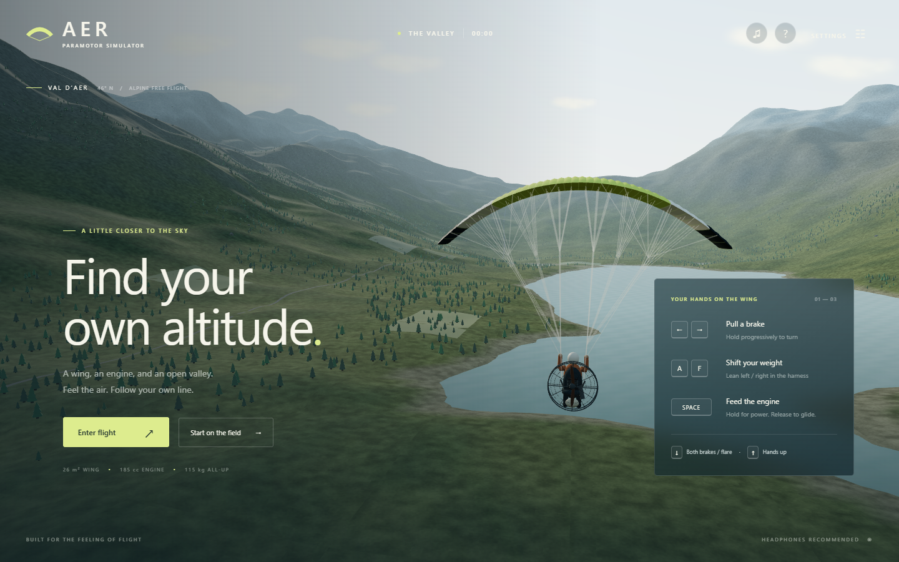

# AER — Paramotor simulator

A keyboard-controlled, third-person paramotor simulator set in a fictional alpine valley. Built with Three.js and a deterministic, force-based flight model. All visual and sound assets are generated locally; there are no runtime asset downloads, external fonts, accounts or telemetry.



## Run

Requires Node.js 22.12+ or a supported newer LTS release, and a desktop browser with WebGL 2 and hardware acceleration.

```powershell
cd C:\projects\paramotor-simulator
npm install
npm run dev
```

Open **http://127.0.0.1:5173**. Choose **Enter flight** to begin 180 m above the airfield, or **Start on the field** for a powered takeoff with an already inflated canopy. Audio starts after entering flight.

```powershell
npm test             # deterministic flight mechanics and terrain tests
npm run test:browser # Chrome integration tests; dev server must be running
npm run build        # production files in dist/
npm run preview      # serve the production build locally
```

Browser tests use locally installed Google Chrome. Screenshots are written to the ignored `test-results/` directory. Set `AER_URL` to test a different server, including the production preview.

## Controls

| Key | Action |
| --- | --- |
| ← / → | Progressively pull the left / right brake; releasing the key raises that hand |
| ↓ | Progressively pull both brakes for slowing and flaring |
| ↑ | Raise both hands; overrides all other brake inputs |
| Space (hold) | Full throttle demand; engine spools up smoothly |
| Space (release) | Return to idle and glide |
| A / F | Shift weight left / right in the seat |
| P / Escape | Pause or resume |
| H | Flight guide |
| C | Switch between two rear chase distances |
| M | Mute / unmute |
| R | Restart airborne |

Brake travel takes time. Use short holds and release to feel the response. Holding a brake continuously eventually reaches deep travel and can stall that side. Throttle changes the climb much more than airspeed. Pulse Space to maintain height. The chase camera keeps the horizon nearly level while showing the suspended pilot and moving wing.

## Included

- Lift, profile and induced drag, gravity, density variation, propeller thrust and fuel consumption.
- Progressive independent brake travel, weight steering, roll inertia, torque bias, suspended pilot motion, symmetric and asymmetric stall approximations, and recovery.
- Ground run, powered takeoff, gliding, flare response, touchdown assessment and collision with terrain, water, trees and buildings.
- Still air, a valley breeze, and a thermal preset with cores, surrounding sink, gusts and wind gradient.
- Original 40-cell deforming canopy, branching suspension lines, moving pilot arms and harness, propeller cage/net, engine and spinning propeller.
- A roughly 12 × 12 km flight area, terrain, lake, woods, fields, road, airstrip, buildings, windsock, atmosphere and clouds.
- Flight instruments, brake/weight indicators, heading, moving map with flight trail, audio, pause and flight log.
- High and balanced rendering settings, persisted locally. Pixel density and shadows change immediately; terrain/vegetation density uses the saved setting on reload.

## Model and scope

The handling was researched against manufacturer flight manuals and engine specifications. Read [the research and flight-model notes](docs/FLIGHT_MODEL.md) for sources, equations, calibration and limitations.

This is an original reduced-order simulator, **not a validated digital twin or a training device**. It does not simulate fabric/line structural dynamics, full six-degree-of-freedom aerodynamics, launch inflation, riser techniques, a reserve, or reliable real-world collapse/acrobatic behavior. The valley is synthetic, not a surveyed location. Realism here means consistent forces, plausible performance and recognizable control consequences, with those limits stated explicitly.

## Code map

| File | Responsibility |
| --- | --- |
| `src/physics.js` | Deterministic SI-unit flight model and weather |
| `src/math.js`, `src/terrain.js` | Shared terrain height, seeded noise and terrain mesh |
| `src/aircraft.js` | Deformable canopy, rigging and animated pilot/motor |
| `src/environment.js` | Landscape, sky, vegetation, airfield and obstacle index |
| `src/controls.js` | Keyboard input and focus handling |
| `src/audio.js` | Locally synthesized engine, wind and variometer |
| `src/ui.js`, `src/style.css` | Menus, instruments, map and responsive interface |
| `src/main.js` | Fixed-step loop, camera, renderer and application state |

Physics runs at 120 Hz, independently of render rate. The accumulator caps long frame delays; it intentionally does not fast-forward a flight after a suspended tab. Losing focus pauses the simulation and clears pressed keys. There is no multiplayer or backend.

See [asset provenance](docs/ASSETS.md). The Git repository is initialized locally; no remote is configured.

Local test results and their scope are recorded in [validation](docs/VALIDATION.md).
